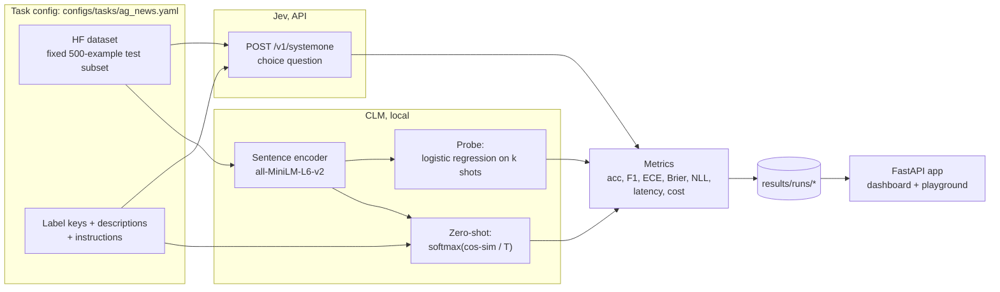

# CLM vs Jev: contrastive embeddings vs a typed-decision model

A hands-on, reproducible comparison of two ways to make **typed decisions about text**:

| | **CLM** (contrastive language model) | **Jev** (TypeSafe AI) |
|---|---|---|
| What it is | Contrastively trained sentence encoder (`all-MiniLM-L6-v2`) | Proprietary "System One" model behind an API |
| How it classifies | Embedding similarity to label descriptions (zero-shot) or a small trained probe | A `choice` question with option descriptions |
| Output | Embeddings → probabilities we compute | Typed answer + a probability for every option |
| Runs | Locally, CPU is fine | Remote API, billed per input token |

Both methods get **the same label descriptions** and are scored on **the same 500 test
examples**, on accuracy, calibration, latency, cost and how much labeled data they need.
A local web app shows the results and lets you compare the models live on any text.

> This is a learning and evaluation project, not a production system. Every conclusion
> applies only to the dataset, label wording and sample size actually tested.

---

## Contents

- [Key results](#key-results)
- [How it works](#how-it-works)
- [Quick start](#quick-start)
- [Step-by-step execution](#step-by-step-execution)
- [The comparison app](#the-comparison-app)
- [Methods and variants](#methods-and-variants)
- [Metrics explained](#metrics-explained)
- [Configuration](#configuration)
- [Outputs](#outputs)
- [Reproducibility and fairness rules](#reproducibility-and-fairness-rules)
- [Cost](#cost)
- [Troubleshooting](#troubleshooting)
- [Project structure](#project-structure)
- [Testing](#testing)
- [Known limitations and roadmap](#known-limitations-and-roadmap)
- [References](#references)

---

## Key results

AG News topic classification (world / sports / business / sci_tech), 500 fixed test articles.
CLM rows are mean ± std over 3 seeds. The Jev row shows its 95% bootstrap CI.

| Method | Labeled examples | Accuracy | ECE ↓ | NLL ↓ | Latency | Cost / 1k texts |
|---|---|---|---|---|---|---|
| **Jev** (`jev-1.13.0`) | **0** | **88.0%** [85.2–90.6] | 0.081 | 1.455 | 337 ms (network p50) | $0.018 |
| CLM zero-shot, no labels | 0 | 76.2% | **0.042** | 0.647 | ~8 ms (local CPU) | $0 |
| CLM zero-shot, temperature-scaled | 500 | 76.2% ± 0.0 | 0.047 | 0.644 | ~8 ms | $0 |
| CLM probe, C=1 *(before fix)* | 64 | 81.2% ± 0.7 | 0.394 | 0.948 | ~9 ms | $0 |
| CLM probe, CV-chosen C *(after fix)* | 64 | 79.4% ± 0.9 | 0.052 | **0.554** | ~9 ms | $0 |

**What this suggests (for this task only):**

- **Jev is clearly the most accurate, with zero labels.** It beats the 64-label probe by about
  7 points and label-free CLM by about 12. The intervals don't overlap.
- **CLM is better calibrated, about 40× faster, and free.** It also runs offline, and the data never leaves the machine.
- **Jev's probabilities are mildly overconfident.** Mean top probability is 0.955 against 0.88
  accuracy, and in **23/500** cases Jev gave the correct label **exactly 0%**. Those cases make up
  87% of its NLL. Treat a Jev `0.0` as "unlikely", never "impossible".
- **Fixing the probe's calibration cost accuracy:** ECE went from 0.39 to 0.05, but accuracy fell about 2 points.

Full notes: [`results/NOTES.md`](results/NOTES.md). Per-run table: [`results/summary.md`](results/summary.md).

---

## How it works



Every method returns a probability matrix `(N, C)` in the task's label order, so all methods
share one metrics implementation.

---

## Quick start

**Requirements:** Python 3.11+, [uv](https://docs.astral.sh/uv/), and (for Jev) a TypeSafe API key.

```bash
git clone https://github.com/natrajexplore/clm_vs_jev_models.git
cd clm_vs_jev_models
uv sync                      # install dependencies into .venv
uv run pytest                # 23 tests, no network or API key needed
```

Add your Jev key (from https://console.typesafe.ai/keys) to a `.env` file in the project root:

```dotenv
TYPESAFE_API_KEY=your-key-here
```

`.env` is gitignored. The code reads the key from the environment, and `uv run --env-file .env`
loads it for you.

Start the app and open **http://127.0.0.1:8006**:

```bash
uv run --env-file .env uvicorn clm_jev_model_comparison.app.server:app --port 8006
```

The repository already contains the result runs, so the dashboard works right away.

---

## Step-by-step execution

### 1. Smoke-test Jev (costs well under a cent)

```bash
uv run --env-file .env python -m clm_jev_model_comparison.run \
    --task configs/tasks/ag_news.yaml --method configs/methods/jev.yaml \
    --set task.test_size=3 method.cache=null
```

A metrics summary with `"model_version": "jev-1.13.0"` means the key works.

### 2. Run every method

```bash
T=configs/tasks/ag_news.yaml
RUN="uv run --env-file .env python -m clm_jev_model_comparison.run --task $T"

$RUN --method configs/methods/jev.yaml                     # 500 API calls, cached afterwards
$RUN --method configs/methods/clm_zeroshot_nolabels.yaml   # label-free CLM

for s in 0 1 2; do                                         # CLM variants over 3 seeds
  $RUN --method configs/methods/clm_zeroshot.yaml     --set method.seed=$s
  $RUN --method configs/methods/clm_probe_fixedC.yaml --set method.seed=$s
  $RUN --method configs/methods/clm_probe.yaml         --set method.seed=$s
done
```

<details>
<summary>PowerShell equivalent</summary>

```powershell
$T = "configs/tasks/ag_news.yaml"
function Run($m, $extra) { uv run --env-file .env python -m clm_jev_model_comparison.run --task $T --method $m @extra }

Run configs/methods/jev.yaml @()
Run configs/methods/clm_zeroshot_nolabels.yaml @()
foreach ($s in 0, 1, 2) {
  Run configs/methods/clm_zeroshot.yaml     @("--set", "method.seed=$s")
  Run configs/methods/clm_probe_fixedC.yaml @("--set", "method.seed=$s")
  Run configs/methods/clm_probe.yaml        @("--set", "method.seed=$s")
}
```
</details>

On a CPU laptop each CLM run takes about 30 s, mostly loading the dataset and model. The Jev
run (500 requests, 8 at a time) took about 22 s.

### 3. Summarize

```bash
uv run python -m clm_jev_model_comparison.eval.compare    # prints and writes results/summary.md
```

### 4. Explore

```bash
uv run --env-file .env uvicorn clm_jev_model_comparison.app.server:app --port 8006
```

### 5. Record what you learned

Add an entry to [`results/NOTES.md`](results/NOTES.md): what changed, what happened, what it
suggests, and which config and seed produced it.

---

## The comparison app

A FastAPI backend with a single-page frontend (plain HTML/JS/SVG, no build step). It has
light and dark themes.

| Section | What it shows |
|---|---|
| **Headline tiles** | Jev accuracy, best CLM accuracy, Jev latency, Jev cost per 1k texts |
| **Results table** | Every variant: labels used, seeds, accuracy (± std or CI), macro-F1, ECE, Brier, NLL, latency, cost |
| **Accuracy vs calibration** | Scatter with ± std whiskers. Up is more accurate, left is better calibrated. Hollow markers are "before fix" configs |
| **Reliability diagrams** | Accuracy per confidence bin against the diagonal, one per variant. Bars below the diagonal are overconfident |
| **Corrective actions** | Issues found, what changed, before/after numbers, and a status (fixed / mitigated / open) |
| **Playground** | Type any text and see Jev, CLM zero-shot and CLM probe predictions with probabilities and latency |

**API endpoints**

| Endpoint | Purpose |
|---|---|
| `GET /` | The dashboard |
| `GET /api/results` | Runs grouped by `(task, method, variant)`: mean/std over seeds + pooled reliability bins |
| `GET /api/task` | Task name, instructions and labels |
| `POST /api/predict` `{"text": "..."}` | Live predictions from all three models |

Notes:

- The dashboard re-reads `results/runs/` on every load, so new runs appear after a refresh.
- The **first playground request takes about 30 s** while the dataset and models load. After that,
  CLM answers in about 10 ms and Jev in about 0.4 s.
- Every playground request makes **one real Jev API call**, with no cache, so the latency is real.
- The Jev key stays on the server and never reaches the browser. Without a key the dashboard
  and CLM still work, and the Jev panel shows the error.
- Environment overrides: `CLM_JEV_RUNS` (runs folder) and `CLM_JEV_TASK` (task config).

---

## Methods and variants

Each file in `configs/methods/` is one variant. "Before" configs are kept on purpose, so every
corrective action can be reproduced.

| Config | `method` / `variant` | Labeled data | Probabilities come from |
|---|---|---|---|
| `jev.yaml` | `jev` / `zero_shot` | none | Jev `choice` answer, `probabilities` field |
| `clm_zeroshot_nolabels.yaml` | `clm_zeroshot` / `no_labels` | none | softmax(cosine similarity / T), T fixed at 0.05 |
| `clm_zeroshot.yaml` | `clm_zeroshot` / `temp_scaled` | 500 train examples, used only to fit T | same, with a fitted temperature |
| `clm_probe_fixedC.yaml` | `clm_probe` / `fixed_C` | 16 per class | logistic regression, C = 1.0 |
| `clm_probe.yaml` | `clm_probe` / `cv_C` | 16 per class | logistic regression, C chosen by 4-fold CV log-loss on those shots |

**Why the zero-shot variants have identical accuracy:** temperature rescales probabilities but
never changes which label is most likely. Only calibration differs.

---

## Metrics explained

| Metric | Meaning | Better |
|---|---|---|
| **Accuracy** | Share of correct top predictions. Single runs include a 95% bootstrap CI | higher |
| **Macro-F1** | F1 averaged over classes equally | higher |
| **ECE** | Expected calibration error: the gap between confidence and actual accuracy, averaged over 15 bins. 0 = "80% confident" really means right 80% of the time | lower |
| **Brier** | Mean squared error between the probability vector and the true one-hot label | lower |
| **NLL** | Negative log-likelihood of the true label. Heavily punishes confident mistakes. Probabilities are clipped at 1e-12, so an exact 0.0 costs about 27.6 | lower |
| **Latency** | Jev: per-request network round trip (p50). CLM: local CPU time per example, amortized over a batch. **Not the same measurement** | lower |
| **Cost** | Jev: input tokens × price in `jev.yaml`. CLM: $0 API cost (local compute) | lower |
| **Labeled examples used** | How much labeled training data the method consumed | lower |

Jev also returns a `confidence` field. It's a concentration statistic derived from the
probabilities, **not** a calibrated probability, so the metrics use `probabilities`.

---

## Configuration

Configs are plain YAML. Override any key from the command line with dotted paths:

```bash
--set task.test_size=100 method.shots_per_class=64 method.seed=3
```

- **`configs/tasks/*.yaml`**: dataset (`hf_path`, splits, fields), `test_size`, `seed` (fixes
  the test subset for every method), `instructions`, and `labels` (key + description, in dataset
  label-id order).
- **`configs/methods/*.yaml`**: `name`, `variant`, `seed` (the method's own sampling), plus
  method settings such as model, temperature, shots, the `C` grid, Jev concurrency, retries, cache and price.

**Adding a new task:** copy `ag_news.yaml` and point `hf_path` at any Hugging Face dataset with
a text column and a `ClassLabel` column. List the labels in id order with clear descriptions.
Both methods use those descriptions.

---

## Outputs

Each run writes `results/runs/<task>_<method>_<variant>_s<seed>_<timestamp>/`:

| File | Contents |
|---|---|
| `config.yaml` | Full resolved task + method config |
| `predictions.jsonl` | Per example: label, prediction, probabilities (+ Jev choice, confidence and latency) |
| `metrics.json` | All metrics, CI, labeled examples used, latency, cost, token counts, Jev model version |

Jev responses are cached in `results/cache/jev_cache.jsonl`, keyed by the exact request, so
reruns and re-analysis are free. The cache is gitignored.

---

## Reproducibility and fairness rules

- **Same inputs:** both methods see identical label descriptions and the same fixed test subset.
- **No test leakage:** temperatures, probe `C` and all tuning use **training** data only.
- **Seeds are separate:** `task.seed` fixes *what is tested*, and `method.seed` varies *how the
  method samples*, which gives honest error bars.
- **Keep baselines:** fixes add a new variant instead of overwriting the old one.
- **Log everything:** every metric is stored next to the config and seed that produced it, and
  Jev's exact model version is recorded (`jev-latest` is a moving alias).

---

## Cost

Jev is billed per input token ($0.042 per million at the time of writing; output is free).
Each AG News request is about 430 input tokens, including the question and option descriptions:

| Workload | Approx. cost |
|---|---|
| 3-example smoke test | < $0.0001 |
| Full 500-example run | ~$0.009 |
| 1,000 playground queries | ~$0.02 |

The CLM runs locally with no API cost.

---

## Troubleshooting

| Symptom | Fix |
|---|---|
| `RuntimeError: Set the TYPESAFE_API_KEY environment variable` | Add the key to `.env` and start commands with `uv run --env-file .env ...` |
| `Jev API error 401` | The key is invalid or revoked. Copy it again from console.typesafe.ai/keys |
| `Jev API error 422` | Request validation failed. Check label keys/descriptions in the task config |
| 429 / 529 errors | Rate limited. The client retries with backoff; lower `method.max_concurrency` if it persists |
| Port 8006 already in use | Stop the other process or pick another port: `--port 8010` |
| Playground's first request is slow | Expected: it loads the dataset and model once (about 30 s) |
| First run is slow | Hugging Face downloads the dataset and model once, then caches them |
| `Dataset scripts are no longer supported` | That dataset uses a loading script; `datasets` 5.x needs a parquet version |
| Line-ending warnings on `git add` (Windows) | Harmless: Git is converting LF to CRLF |

---

## Project structure

```
.
├── CLAUDE.md                     # project spec and conventions for AI-assisted work
├── README.md
├── configs/
│   ├── tasks/ag_news.yaml        # dataset, test subset, instructions, labels
│   └── methods/                  # one file per variant
├── src/clm_jev_model_comparison/
│   ├── run.py                    # one method × one task -> predictions + metrics
│   ├── data/tasks.py             # HF dataset -> TaskData; k-shot sampling
│   ├── models/clm.py             # encoder, zero-shot probs, temperature fit, probe (+CV)
│   ├── models/jev.py             # Jev client: async, retries/backoff, disk cache
│   ├── eval/metrics.py           # accuracy, CI, F1, ECE, Brier, NLL, reliability, latency
│   ├── eval/compare.py           # all runs -> results/summary.md
│   ├── app/server.py             # FastAPI backend
│   ├── app/static/index.html     # dashboard + playground
│   └── utils/                    # config overrides, seeding, run directories
├── results/
│   ├── runs/                     # committed experiment outputs
│   ├── summary.md                # per-run table
│   └── NOTES.md                  # experiment journal
└── tests/                        # metrics, CLM math, Jev client (mocked), server, configs
```

---

## Testing

```bash
uv run pytest -q
```

23 tests. They never call the real Jev API; the client is tested against `httpx.MockTransport`.

- **Metrics:** known-value checks for ECE, Brier, NLL, bootstrap CI and reliability bins.
- **CLM math:** softmax normalization, temperature fitting minimizes NLL, probe CV and k-shot sampling.
- **Jev client:** request shape and auth header, parsing, retry on 429, non-retryable errors, cache hits, missing key.
- **Server:** grouping over seeds, input validation, and serving the page.

---

## Known limitations and roadmap

| Status | Item |
|---|---|
| Open | **Only one dataset.** AG News has 4 balanced classes. Next: a many-label task (CLINC150, or a parquet mirror of Banking77), where Jev's up-to-255-option Choice and few-shot probes should diverge most |
| Open | **Probe `C` search range too narrow.** CV chose C=1000 (the top of the range) on 2 of 3 seeds; widen it |
| Open | **Jev run-to-run variation untested.** Re-query a sample without the cache and compare probabilities |
| Open | **Jev exact-zero probabilities.** Investigate the 23 cases; consider reporting to TypeSafe |
| Mitigated | **Latency not like-for-like.** A fair deployment comparison would serve the CLM behind HTTP too |
| Idea | Larger or better CLM encoders (e.g. `bge`, `e5`) and more shots per class |
| Idea | Jev `score` and `noul` primitives on graded or yes/no tasks |

---

## References

- TypeSafe AI docs: https://docs.typesafe.ai (API: `/api`, Choice: `/primitives/choice`, models and pricing: `/models`)
- Sentence-Transformers: https://www.sbert.net, model `sentence-transformers/all-MiniLM-L6-v2`
- AG News dataset: https://huggingface.co/datasets/fancyzhx/ag_news
- Guo et al., *On Calibration of Modern Neural Networks* (2017): temperature scaling and ECE
